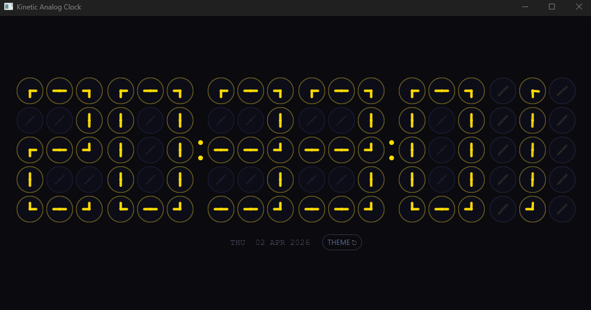
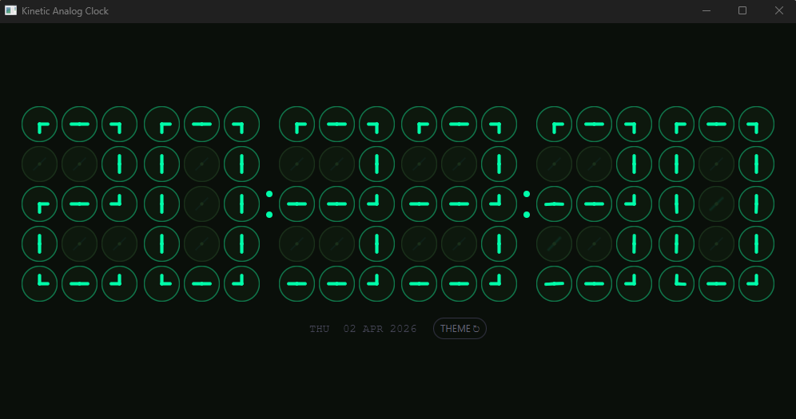
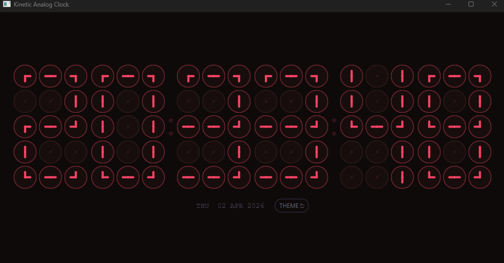

# Kinetic Analog Clock 🕒

A high-precision, visually elegant Analog Clock built with **JavaFX**. This project demonstrates the use of trigonometric mathematics to create smooth, real-time UI updates, transforming standard system time into a fluid kinetic display.

---

## 🚀 Overview

The Kinetic Analog Clock is more than just a time-teller; it's a study in **JavaFX transitions** and **UI Geometry**. By calculating the precise angles for the second, minute, and hour hands every 100ms, the app provides a smooth "sweep" motion similar to high-end mechanical watches.

## ✨ Key Features

* **Real-time Synchronization:** Accurately pulls time from the system clock (`LocalTime`).
* **Fluid Motion:** Uses JavaFX `AnimationTimer` or `Timeline` for high-refresh-rate movement.
* **Trigonometric Logic:** Custom calculations for hand placement using:
    * $Angle_{sec} = second \times 6^\circ$
    * $Angle_{min} = minute \times 6^\circ$
    * $Angle_{hour} = (hour \pmod{12} \times 30^\circ) + (minute \times 0.5^\circ)$
* **Modern Aesthetic:** Clean, minimalist design with CSS-styled nodes.
* **Responsive Scaling:** The clock maintains its proportions even when the window is resized.

## 🛠️ Tech Stack

* **Language:** Java 17+
* **UI Framework:** JavaFX
* **Styling:** JavaFX CSS (.css)
* **Mathematics:** Trigonometry for coordinate mapping ($x = r \cdot \cos(\theta)$, $y = r \cdot \sin(\theta)$)

## 📂 Project Structure

* `src/main/java`: Logic for time calculation and UI rotation.
* `src/main/resources`: Stylesheets for the clock face and hands.
* `.gitignore`: Configured to keep the repo clean of IntelliJ/Build junk.

## ⚙️ Installation & Setup

1.  **Clone the Repository:**
    ```bash
    git clone [https://github.com/Injabin/Kinetic_Analog_Clock.git](https://github.com/Injabin/Kinetic_Analog_Clock.git)
    ```
2.  **Open in IntelliJ:**
    * Ensure JavaFX SDK is added to the project libraries.
3.  **Run:**
    * Execute `Main.java` or your Application class to see the clock in action.

## 📸 Preview




---
**Developed with 🕒 by [Injabin](https://github.com/Injabin)**